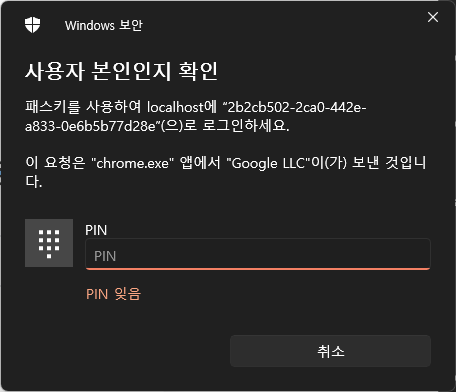

# MYSQL 설치 필요

## application.yml
```datasource:
     url: jdbc:mysql://localhost:3306/pbl?useSSL=false&serverTimezone=Asia/Seoul
     username: root
 ```
- mysql://localhost:3306/pbl 여기를 맞춰서 수정 or pbl 연결(뭐라하냐) 아무튼 생성
- username: root -> 기본이 root 인데 수정했을경우 수정한걸로

## application-secret.yml
이 파일은 없음 -> 만들어야함 (비밀번호, 키 같은 값들어있음)
```angular2html
spring:
  datasource:
    password: 1234
```
- 여기서 sql 비밀번호 설정했으면 거기에 맞게 설정할것 여기선 비번이 1234인것
- 여기에 추가해야 할거 있는데 카톡보고 알아서 넣을것

==================================================================
# https 적용 후 local상태에서 편하게 쓰는 방법 
# - mkcert 설치 

## 1) Chocolatey 설치 (이미 설치했다면 생략) - CMD or PowerShell에서
Set-ExecutionPolicy Bypass -Scope Process -Force
[System.Net.ServicePointManager]::SecurityProtocol = 'Tls12'
iex ((New-Object System.Net.WebClient).DownloadString('https://community.chocolatey.org/install.ps1'))

## 2) mkcert 와 Firefox용 nss 설치
choco install mkcert -y
choco install nss     -y

## 3) 로컬 루트 CA 생성 및 설치
mkcert -install

## 4) localhost용 인증서 발급 (할필요 X)
mkcert localhost 127.0.0.1 ::1


### - 프론트도 받아서 실행해야함

# 이후 테스트 - 안되면 물어보세용


===========================================================

## 대충 실행 화면





### 기능 
로그인, 회원가입, WebAuthn등록 및 로그인, 로그아웃, 로그인 유지시간 갱신 (토큰: JWT, 리프레시 토큰 - 쿠키저장(HttpOnly로 JS차단함), 액세스 토큰 - Web Storage 저장, https 사용 )

